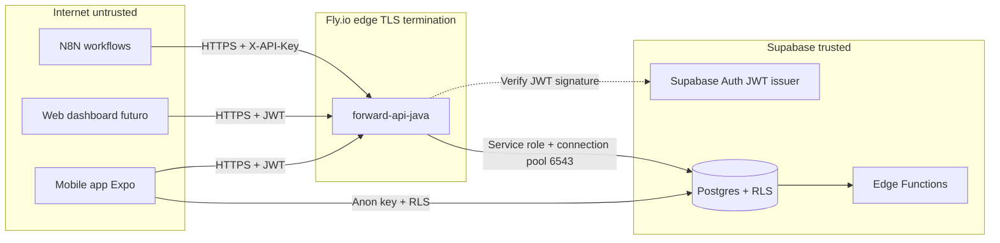

# Security model — ForwardService infra

Modelo de ameaças (STRIDE) e controles aplicados ao perímetro infra do
ForwardService: banco Postgres no Supabase, Edge Functions, docker compose
local, secrets management e migrations. Foco em Sprint 1 do Desafio Ford x
FIAP 2026 (disciplina Cybersecurity). Componentes de aplicação (Java API,
mobile) cobertos nos respectivos repos.

> Última revisão: 2026-05-24 — Sprint 1 cut.

## 1. Escopo

Cobre a camada de dados e infraestrutura de runtime:

- Banco Postgres (Supabase, projeto `ysewoopjgdpvnkfhffgy`, região São Paulo).
- 12 migrations SQL (`supabase/migrations/001..012`).
- Row Level Security (RLS) e RBAC com 4 roles.
- Audit log append-only.
- Edge Functions (planejadas, ainda não implementadas).
- Docker compose local (Postgres + API + reverse proxy).
- Secrets em `.env` (gitignored) e Fly.io / GitHub Secrets em prod.

Fora de escopo deste documento (mas cobertos nos repos respectivos):

- JWT validation, rate limit, CORS: `forward-api-java/src/main/java/.../security/`.
- Mobile auth flow: `forward-mobile/lib/auth.ts`.

## 2. Ativos protegidos

| Ativo | Sensibilidade | Localização |
| ----- | ------------- | ----------- |
| CPF do cliente | Alta (LGPD dado pessoal) | `customers.cpf_hash` (SHA-256), CPF claro nunca armazenado em texto |
| Telefone, email, endereço | Média (LGPD contato) | `customers.phone`, `email`, `city`, `state` |
| VIN (chassi) | Média (identifica veículo) | `vehicles.vin` |
| Histórico de serviço | Média (comportamento) | `service_events`, `service_orders` |
| Score de churn (predição) | Média (deriva de comportamento) | `churn_scores` |
| Credenciais (DB, JWT secret) | Crítica | `.env` (local), Fly secrets (prod), GitHub Actions secrets (CI) |
| Audit trail | Alta (não-repúdio) | `audit_log` (append-only) |
| Lead / outcome | Baixa | `leads`, `lead_outcomes` |

## 3. Fronteiras de confiança (trust boundaries)

Cruzamentos de fronteira que exigem validação:

1. Internet ⇒ Edge: TLS 1.2+ obrigatório (`force_https = true` em `fly.toml`).
2. Edge ⇒ Supabase: JWT assinado pela Supabase Auth (HS256 ou JWKS via
   `AlgAwareJwtValidator`).
3. Mobile ⇒ DB direto: apenas com `anon` key + RLS policies (migration 010).

## 4. Análise STRIDE

### 4.1 Spoofing (identidade falsa)

| Ameaça | Vetor | Mitigação |
| ------ | ----- | --------- |
| Atacante se passa por usuário autenticado | Roubo de JWT (XSS, MITM) | TLS obrigatório; JWT com `exp ≤ 1h` na Supabase; refresh token rotativo |
| Atacante se passa por serviço (N8N) | Vaza `INTERNAL_API_KEY` | Rotação trimestral via `flyctl secrets set`; valor nunca em git (gitleaks bloqueia em CI) |
| Cliente forja role no JWT | Manipula payload | `AuthFilter` valida assinatura antes de ler claims; role checado server-side em RLS + service layer |
| Dealer assume identidade de outro dealer | Modifica `dealer_id` em request | RLS `dealer_id = auth.jwt() ->> 'dealer_id'` em `leads`, `service_events`, `customers` |

### 4.2 Tampering (adulteração)

| Ameaça | Vetor | Mitigação |
| ------ | ----- | --------- |
| SQL injection | Input não-parametrizado | `NamedParameterJdbcTemplate` (Java) + Supabase client (mobile) — nunca concat string |
| Modificação de audit log | Update/delete em `audit_log` | Migration 009: tabela append-only, sem coluna `updated_at`, RLS bloqueia UPDATE/DELETE |
| Adulteração de CPF | Update direto na coluna | CPF nunca armazenado em claro; `cpf_hash` é SHA-256 + per-row salt (planejado para 013) |
| Modificação de seed em prod | Apply migration acidental | Migrations idempotentes (`IF NOT EXISTS`); `supabase migration apply` requer auth |

### 4.3 Repudiation (negação)

| Ameaça | Vetor | Mitigação |
| ------ | ----- | --------- |
| Dealer nega ter alterado lead | Sem trilha | `audit_log` registra `actor_sub`, `action`, `entity_type`, `entity_id`, `before/after` JSONB |
| Admin nega ter rotacionado secret | Mudança fora de banda | Fly.io e GitHub Actions logam quem disparou `secrets set` / `deploy` |
| Quem aprovou merge da migration | Push direto | Branch protection (memory ref `project_repos_status`): main bloqueia force-push e exige PR + CODEOWNERS |

### 4.4 Information Disclosure (vazamento)

| Ameaça | Vetor | Mitigação |
| ------ | ----- | --------- |
| Vazamento de CPF em logs | API loga payload bruto | `logback-spring.xml` JSON + redaction de campos sensíveis; CPF nunca chega à API em claro |
| Dump de DB via SQL injection | Bypass de RLS | RLS forçado em todas tabelas com dados pessoais; `SECURITY INVOKER` em funções |
| Vazamento de secrets em PR | `.env` commitado | `.env` em `.gitignore` (presente); gitleaks roda em CI org-wide |
| Cross-tenant leak (dealer A vê dados de dealer B) | RLS mal escrita | Migration 010 com policies SELECT/INSERT/UPDATE por role e `dealer_id` |
| Telemetria de erro com dados privados | Stack trace exposto | `GlobalExceptionHandler` retorna RFC 7807 sem stack trace; logs separados |
| Email exposto via OpenAPI examples | Schema com PII | Examples usam dados fictícios; PII tem `additionalProperties: false` |

### 4.5 Denial of Service

| Ameaça | Vetor | Mitigação |
| ------ | ----- | --------- |
| Flood de requests autenticados | Bot ou cliente abusivo | Rate limit Bucket4j 60/min por `(IP + subject)` no `RateLimitFilter` |
| Exaustão de conexões DB | API abre conexão por request | HikariCP pool: `max=20, min=2, max-lifetime=30min` |
| Body gigante (1GB JSON) | Cliente malicioso | `max-body-bytes=1048576` (1MB) enforced no Tomcat + filter |
| Query lenta em produção | Sem índice em filtro frequente | Migrations 002-008 declaram índices em FKs e colunas de filtro (`dealer_id`, `vin`, `status`) |
| Supabase quota burn | Webhooks descontrolados | Edge Functions futuras devem ter circuit breaker; limitar via `cron` se possível |

### 4.6 Elevation of Privilege

| Ameaça | Vetor | Mitigação |
| ------ | ----- | --------- |
| User vira admin via UPDATE direto na role | Cliente modifica JWT claim | Role é assinada pela Supabase Auth (não-cliente-editável); RLS sempre re-verifica |
| Anon key consegue ler tabela admin | RLS permissiva demais | Migration 010 nega tudo por default; cada SELECT/INSERT explicitamente permitido por role |
| Service role token vaza | Operador clica em link malicioso | Service role usado SÓ no backend Java (não no mobile); rotação manual em incidente |
| Migration roda como `postgres` superuser | Migration maliciosa | `supabase db push` aplica como service role, não superuser; review humano obrigatório via PR |

## 5. Controles transversais

| Controle | Onde | Status |
| -------- | ---- | ------ |
| TLS 1.2+ obrigatório | Fly.io edge proxy | ✅ `force_https=true` |
| Secrets fora do git | `.env` gitignored + Fly secrets + GH Actions secrets | ✅ |
| Gitleaks em CI | `.github/workflows/secrets-scan.yml` (org reusable) | ✅ |
| Trivy filesystem scan | `.github/workflows/java-security.yml` | ✅ |
| Dependabot | `.github/dependabot.yml` por repo | ✅ |
| Branch protection (main) | Bloqueia force-push e deleção; exige PR + review | ✅ |
| Logs estruturados JSON | `logback-spring.xml` em prod | ✅ |
| Audit log append-only | Migration 009 | ✅ |
| RLS em todas tabelas com PII | Migration 010 | ✅ |
| CPF pseudonimizado (SHA-256) | Migration 002 (`cpf_hash`) | ⚠ atual sem salt per-row (Sprint 2: migration 013) |
| Backups + ponto de restauração | Supabase managed (PITR 7 dias no plano free) | ✅ por padrão |

## 6. Riscos aceitos no Sprint 1

Cada item abaixo é uma decisão consciente de não mitigar agora, com plano de
fechar em Sprint 2. Documentado para fins de auditoria.

| ID | Risco | Por que aceitar | Mitigação Sprint 2 |
| -- | ----- | --------------- | ------------------ |
| R-01 | `customers.email`, `phone`, `birth_date` em texto claro | `pgcrypto` exige rotação de chave que o time ainda não tem runbook | Migration 013: `pgp_sym_encrypt` para `email`, `phone`; chave em Vault Supabase |
| R-02 | Sem retention policy LGPD automática | Sprint 1 não tem volume; deleção manual via runbook é viável | Migration 014: trigger `delete_after_24mo` em `customers.lgpd_consent_at` |
| R-03 | Customers RBAC relaxado (qualquer auth user lê qualquer customer) | Issue #23 do `forward-api-java`: trade-off explícito para destravar mobile demo | Sprint 2: filtrar por dealer ownership via `leads.dealer_id` |
| R-04 | Sem auto-sync openapi.yaml entre forward-api-java e forward-docs | Refresh manual aceitável no curto prazo | Workflow `mirror-openapi.yml` (cron diário ou `repository_dispatch`) |
| R-05 | Edge Functions vazias (webhooks de Supabase Auth, churn re-score) | Não bloqueia demo Sprint 1 | Implementar em Sprint 2 com circuit breaker + idempotency keys |
| R-06 | Sem WAF na frente do Fly.io | Custo + complexidade para a banca | Cloudflare na frente do Fly.io custom domain em Sprint 2+ |
| R-07 | Conflict markers em `forward-docs/.github/workflows/ci.yml` (main) | Bloqueio histórico de PR #12; CI de docs não roda | PR follow-up de 5min para resolver e religar CI |

## 7. Resposta a incidentes (runbook curto)

Vazamento suspeito de secret:

1. Rotacionar imediatamente:
   - DB password: Supabase dashboard > Settings > Database > Reset password.
   - JWT secret: Supabase dashboard > Settings > API > Reset JWT secret.
   - `INTERNAL_API_KEY`: `openssl rand -hex 32` + `flyctl secrets set`.
2. Force-rotate Supabase auth tokens emitidos pelo secret antigo (`pg_temp.kill_active_sessions`).
3. Invalidar token em todos clientes (mobile faz logout via push, web em refresh).
4. Auditar `audit_log` por janela do incidente: queries com `actor_sub` desconhecido.
5. Post-mortem no `forward-docs/incidents/` em até 48h.

Suspeita de SQL injection:

1. Capturar payload do request id correlacionado (`request-id` header em logs JSON).
2. Bloquear IP origem temporariamente via Fly.io firewall rule.
3. Revisar query suspeita; se confirmar, criar test case regressivo antes do fix.
4. Deploy do fix em hotfix branch direto pra `main` (com PR + review acelerado).

## 8. Referências

- OWASP Top 10 (2021).
- LGPD (Lei 13.709/2018), em particular arts. 6º (princípios), 13 (anonimização)
  e 46-47 (segurança e boas práticas).
- STRIDE: Microsoft Threat Modeling.
- Supabase production checklist:
  <https://supabase.com/docs/guides/platform/going-into-prod>.
- Briefing Cybersecurity FIAP: `cyber-challenge.pdf` (raiz do workspace Ford).
